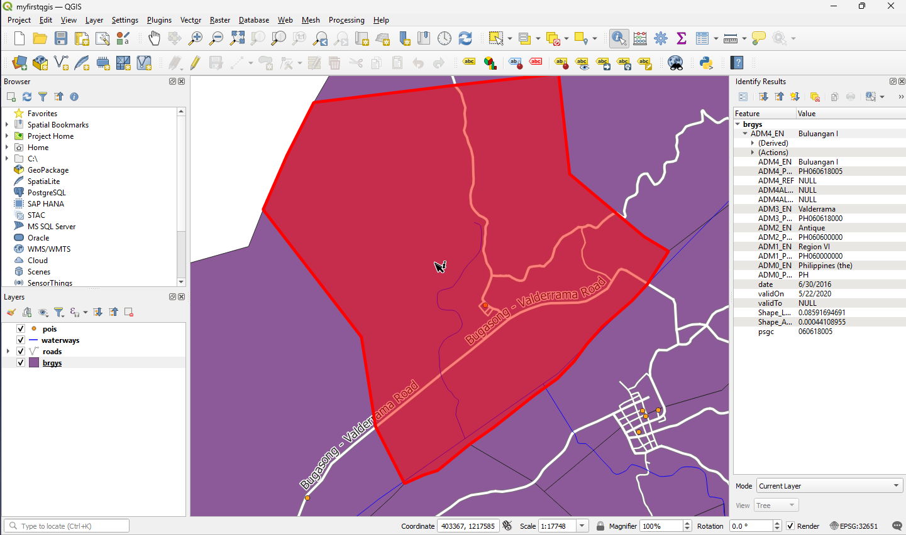
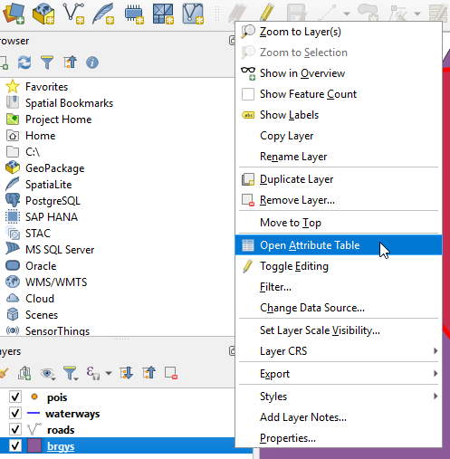
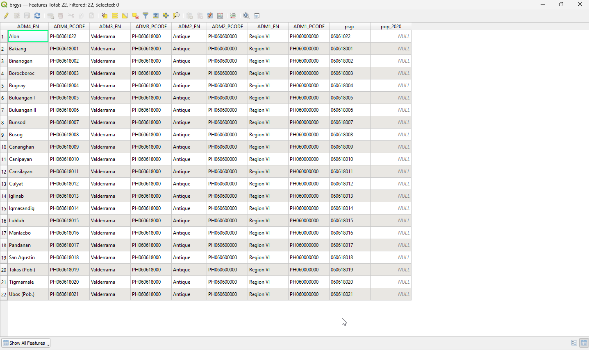
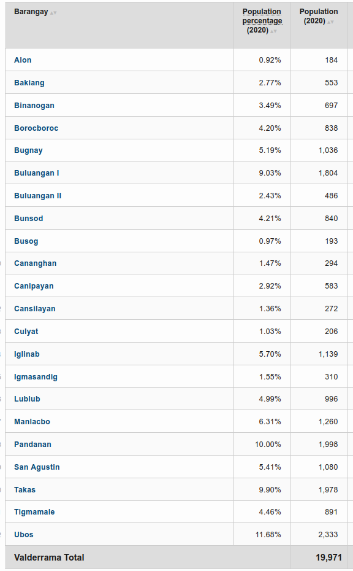
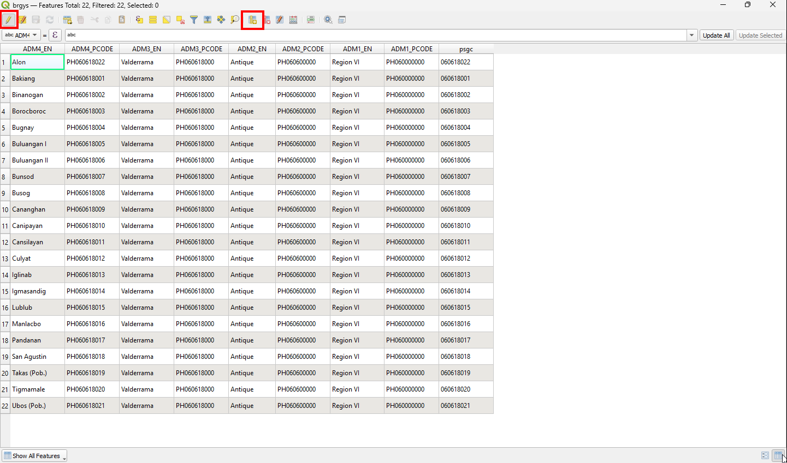
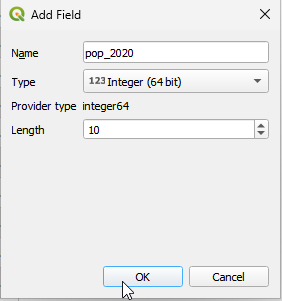
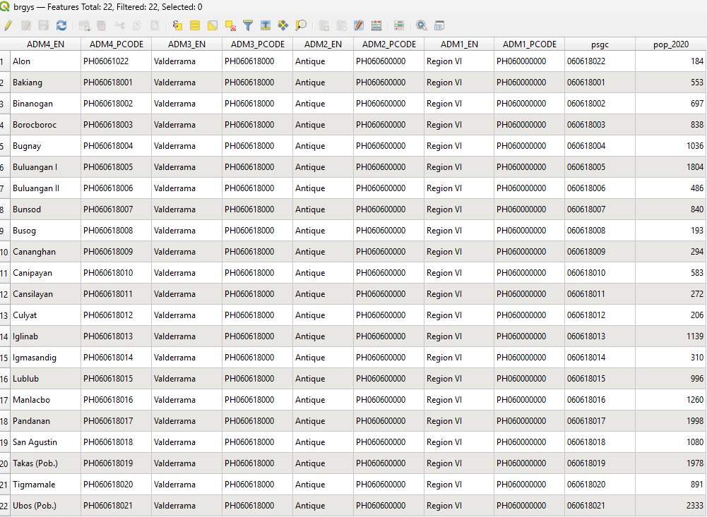
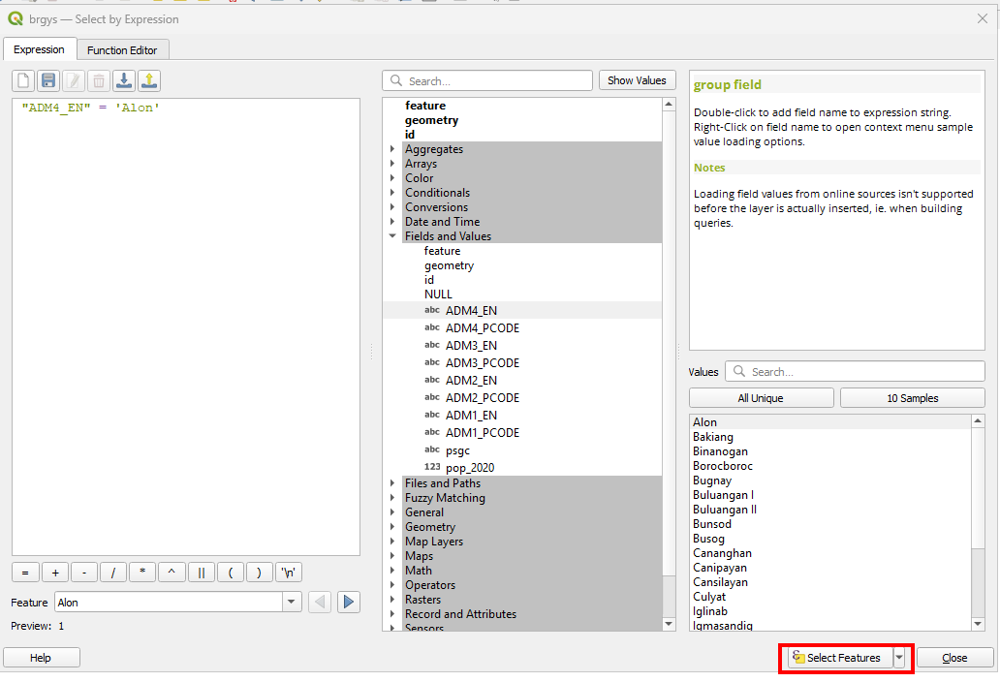
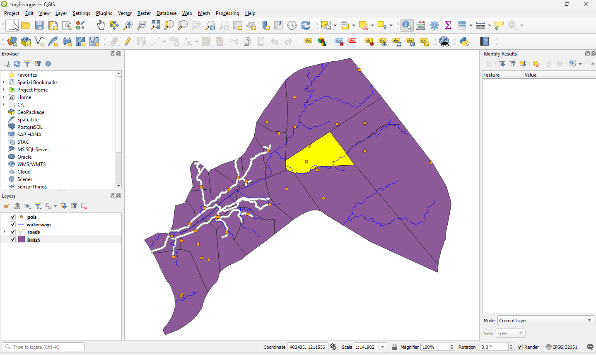
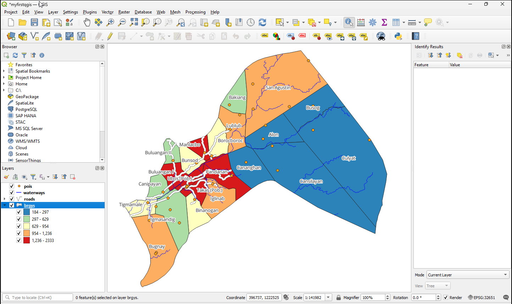

========================
Managing Data Attributes
========================

:term:`Attribute` is non-geographic data associated with to any elements or data in GIS and usually in tabulated form. (In a
:term:`Shapefile` vector format, this is contained in a separate file with ``dbf`` extension). A table is like a spreadsheet. Each column in the table is called a :guilabel:`field`. Each row in the table is a record. Each of the records in the attribute table in a GIS corresponds to one feature. The application "links" the attribute records with the feature geometry so that you can find records in the table by selecting features on the map, and find features on the map by selecting features in the table. Each field in the attribute table contains contains a specific type of data such texts, numbers or date.

:index:`Viewing Data Attributes`
-----------------------------------

In QGIS you can easily view data attributes by either selecting the feature within
the layer of interest or opening the full table.

1. To display the attribute table , select the ``brgys`` layer in :guilabel:`Map layer` panel.  In the :menuselection:`Menu`, select :guilabel:`View` --> |mActionIdentify| :guilabel:`Identify Features`. Or just click the |mActionIdentify| :guilabel:`Identify Features` in the toolbar.

2. Click on any polygon in the map to show the feature attributes.

3. To view the attribute table similar to a spreadsheet, select the ``brgys`` layer in the :guilabel:`Map Legend/Layers`. Right-click the layer and select :guilabel:`Open Attribute Table`.

4. A new window will appear showing the full table of the data layer. You can browse and edit the attribute table within this window.

A full explanation of the tools within the :guilabel:`Attribute table` window is
presented below:

* |mActionUnselectAttributes| :guilabel:`Unselect All` - Remove selection from
  previous selected records
* |mActionInvertSelection| :guilabel:`Invert Selection` - Invert selection
* |mActionEditCopy| :guilabel:`Copy Selected Rows` - Copy selected rows to
  clipboard
* |mActionZoomToSelected| :guilabel:`Zoom Map to Selected Rows` - Zoom map to
  selected rows
* |mActionToggleEditing| :guilabel:`Toggle Editing Mode` - Toggle editing mode to
  edit single values of attribute table and to enable functionalities described
  below.
* |mActionDeleteSelected| :guilabel:`Delete Selected Features` - Delete selected
  features
* |mActionNewAttribute| :guilabel:`New Column` - This adds a new column in the
  attribute table.  You will be asked to provide attribute details in a new
  window (name, field type, etc.).
* |mActionDeleteAttribute| :guilabel:`Delete Column` - Delete column (only for
  PostGIS layers yet)
* |mActionCalculateField| :guilabel:`Open Field Calculator` - Open field
  calculator to update attribute data based on arithmetic, logical and other
  calculations

Explore the different tools to understand how each one works.

.. make this tip more affirmative in tone

.. tip::
   :term:`Shapefile` stores attribute data in a separate file with a ``dbf``
   extension.  This is a widely used GIS database format. You can edit the dbf
   file outside QGIS using a spreadsheet application such as MS Office Excel and
   OpenOffice Calc, however, caution should be taken in order not to corrupt the
   files. Make sure you create a backup before editing the data outside QGIS.

Creating and editing attributes
--------------------------------

We will update the ``brgys`` layer by adding population for each barangays
for the year 2015 census.

1. Open the attribute table by selecting the ``brgys`` layer
in the :guilabel:`Map Legend`. Right-click the layer and select
:guilabel:`Open Attribute Table`.

.. more intructions on creating attribute column via table

2. Scroll to the right most end of the table.  We will add the population data in
the ``Population (2020 Census)`` column. To enable editing in the attribute table, click the
|mActionToggleEditing| :guilabel:`Toggle editing mode` and |mActionNewAttribute| :guilabel:`New Field`.  The municipality
names are in the ``NAME_2`` column.  Start adding the population of each
municipality following the table below:

3. Click again the |mActionToggleEditing| :guilabel:`Toggle editing mode`.
A prompt will appear and click |mActionSaveAllEdits| :guilabel:`Save edits` to save your edits.

Subset displayed data using table queries
------------------------------------------

QGIS can also limit the display of features to a subset of your data using
attribute queries.  It follows the standard
:term:`Structured Query Language (SQL)`
used by other applications for managing databases. We will subset our data to
display only the barangay/village within a specific town/city.

1. Select ``brgys``.
   Right-click and select ``Open Attribute Table``.

Then, click the |mIconExpressionSelect| :guilabel:`Select features using an expression` and a new window will appear.  A new window :guilabel:`Select by expresion` will appear.

.. image:: /images/select_query.png
   :align: center
   :width: 1000 pt

2. In the :guilabel:`Select by Expresion`, click the ``Field and Values`` --> :guilabel:`ADM4_EN`.
   Click ``All Unique`` to display all possible value for the selected field. Type "ADM4_EN" = 'Alon' on the expression field.

The result will be displayed in the :guilabel:`SQL where clause` text box as, ::

    "ADM4_EN" = 'Alon'

This SQL simply means that within the ``ADM4_EN`` attribute column, we will select
and display only the town polygon of ``Alon``.

3. If there are no errors in your SQL, click |mIconExpressionSelect| `Select features`.

.. image:: images/sql_prompt.png
   :align: center
   :width: 1000 pt

The ``brgys`` should show the subset of features in your `Map view`.

4. Style your queried layer showing different colors base on the population for
   the year 2020. Use *Graduated* for style or load the .qml using from the :guilabel:`data/Styles/brgy_pop.qml` folder

Additionnal Youtube Videos
,,,,,,,,,,,,,,,,,,,,,,,,,,

The following videos will guide the users in adding a field and selecting a feature. Offline versions are also available in these links `Video 1 <videos/managing_attributes1.mp4>`_ and `Video 2 <videos/managing_attributes2.mp4>`_.

.. raw:: html

    
5
        <iframe src="https://www.youtube.com/embed/R5hi2RVkmMk" frameborder="0" allowfullscreen style="position: absolute; top: 0; left: 0; width: 100%; height: 100%;"></iframe>
    

.. raw:: html

    

        <iframe src="https://www.youtube.com/embed/3clca1U8rG4" frameborder="0" allowfullscreen style="position: absolute; top: 0; left: 0; width: 100%; height: 100%;"></iframe>
    

.. raw:: latex

   \pagebreak[4]
