===================================
Creating Vector Layers (Digitizing)
===================================

QGIS provides easy-to-use yet very powerful digitizing tools. Digitizing or digitization is a process of encoding map coordinates and attributes in digital form. QGIS allows you to create and edit vector data using various data sources such as text files, paper maps, or satellite imagery. This exercise will guide you through the basic interface of vector digitizing using QGIS.

Creating a new project
----------------------
1. Open QGIS and create a new project. In the menu, select :menuselection:`Project`
--> |mActionFileNew| :guilabel:`New`.

2. Open `Properties` --> :guilabel:`Project Properties` and click the :guilabel:`Coordinate Reference System (CRS)` tab.
Set the following options.

* In the Coordinate Reference System, choose
  :guilabel:`Geographic Coordinate Systems --> WGS 84/Pseudo Mercator`.

:index:`Loading raster data`
----------------------------

1. To load raster data, select :menuselection:`Layer` -->  `Add Layer` --> |mActionAddRasterLayer| :guilabel:`Add Raster Layer`. A prompt may appear asking for the `Coordinate Reference System`.
Select `Projected Coordinate Systems --> WGS 84/Pseudo Mercator`.
(The raster to be opened was saved from **QuickMapServices Google Satellite**, so its original projection must be used to avoid layer misalignment in the map canvas.)

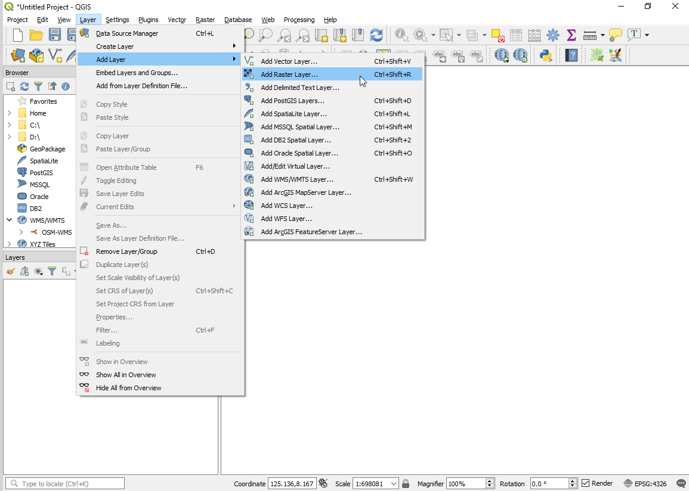

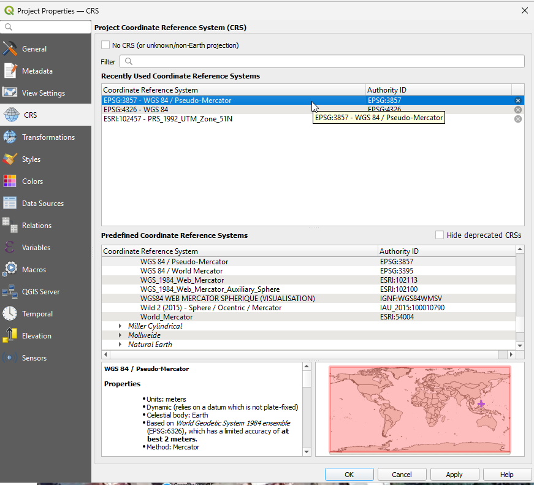

2. Open the `Raster` data file directory and  ``Valderrama_town-proper.jpg``. After setting the raster's coordinate reference system, right click and click |mActionZoomToLayer| as the raster might disappear from the map canvas.

Explore other raster setting using the :guilabel:`Raster Layer Properties` window.

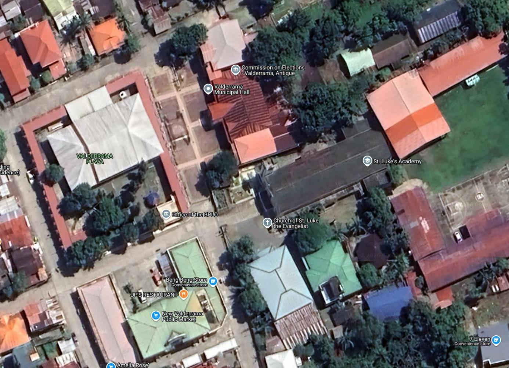

.. note::
   A :term:`Raster` dataset is composed of rows (running across) and columns
   (running down) of :term:`Pixel` (also known as cells or grids). Each pixel represents a
   geographical region, and the value in that pixel represents some characteristics
   of that region.

   Images with a pixel size covering a small area are called 'high resolution'
   images because it is possible to make out a high degree of detail in the image.
   Images with a pixel size covering a large area are called 'low resolution'
   images because the amount of detail the images show is low.

   Some raster data have two files included.  For example, a file with the `jpg`
   extension is the image and the file with the extension `jgw` is the world file.
   World files describe the location, scale and rotation of the map. By adding a
   world file in any image, GIS applications can read and georeference almost any
   image. However, the world file does not give the proper coordinate reference
   system of the raster. More information
   `here <http://en.wikipedia.org/wiki/World_file>`_. In QGIS, you have to
   properly set the CRS for raster with world file.

Loading Vector data
-------------------

1. Open the following
vectors::

      brgys.shp
      roads.shp

2. Re-order all the layers and create a suitable symbology
and color scheme based on the image below. Don't forget to right click and Zoom to Layer

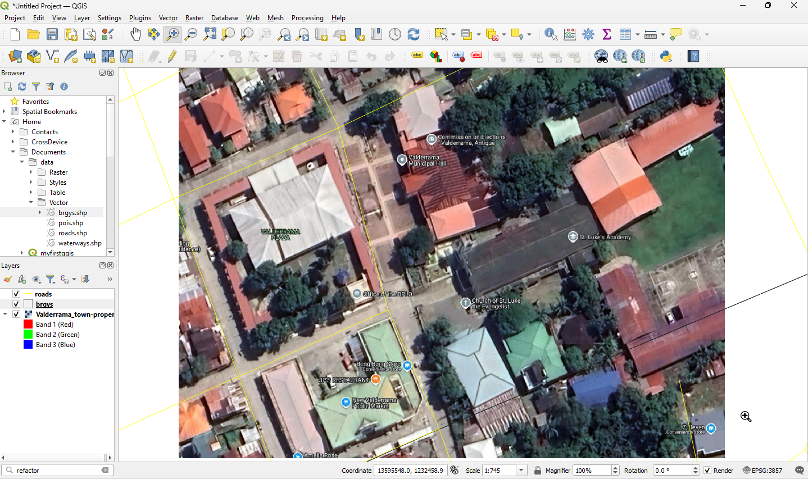

We will use the ``Valderrama_town-proper.jpg`` raster as our primary source for a structures_digitized layer
that will include features such as Brooke's Pt.'s municipal hall, town gymnasium and

:index:`Creating a new vector layer`
------------------------------------

We will now create a new vector layer, to digitize structures_digitized. We will use a polygon
layer to represent this data.

1. To create a new vector layer select :menuselection:`Layer` -->
:guilabel:`Create Layer` --> |mActionNewVectorLayer|
:guilabel:`New Shapefile Layer`.

2. In the :guilabel:`Geometry type` option,
choose :guilabel:`Polygon`.

3. In the :guilabel:`Specify CRS`, select
:guilabel:`EPSG 4326 - WGS 84`.

4. In the :guilabel:`New Field`, add ``name`` in the :guilabel:`Name` field
and choose :guilabel:`Text Data` as the data type. Then, click
:guilabel:`Add to Attributes List`.  The newly added attribute field is
added in the list.

5. Add another attribute column. In the :guilabel:`New Field`, add ``type`` in
the :guilabel:`Name` field and choose :guilabel:`Text Data` as the data type. Then,
click :guilabel:`Add to Fields List`.

In the ``name`` attribute field, we will encode the name of the feature. In the
``type`` attribute field we encode the type of structure (stadium, building, mall).
Click :guilabel:`OK`.

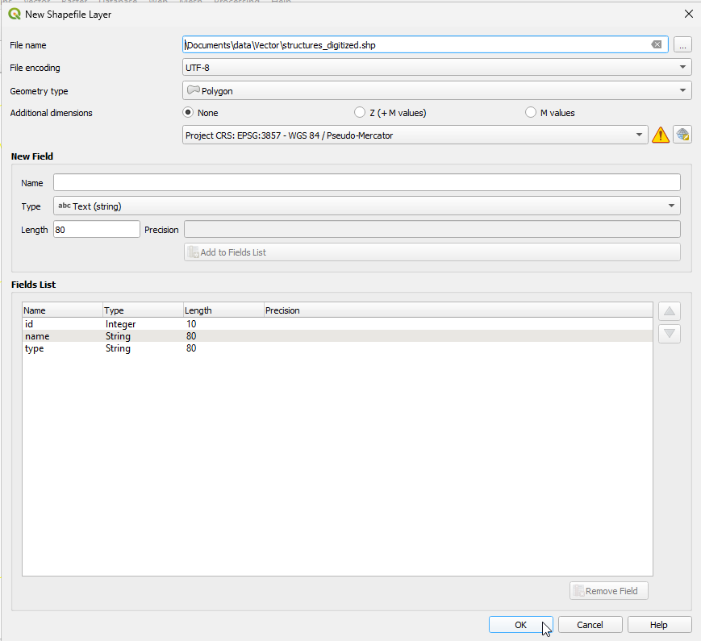

.. tip::
   Limit field names to a maximum of 10 characters and avoid special characters
   (such as ``&, #, @ {`` ) and spaces.

6. Click the |button| symbol. A new window will appear for the file name and location of the data within your
directory. Use the file name, ``structures_digitized.shp``. Click `Save`.

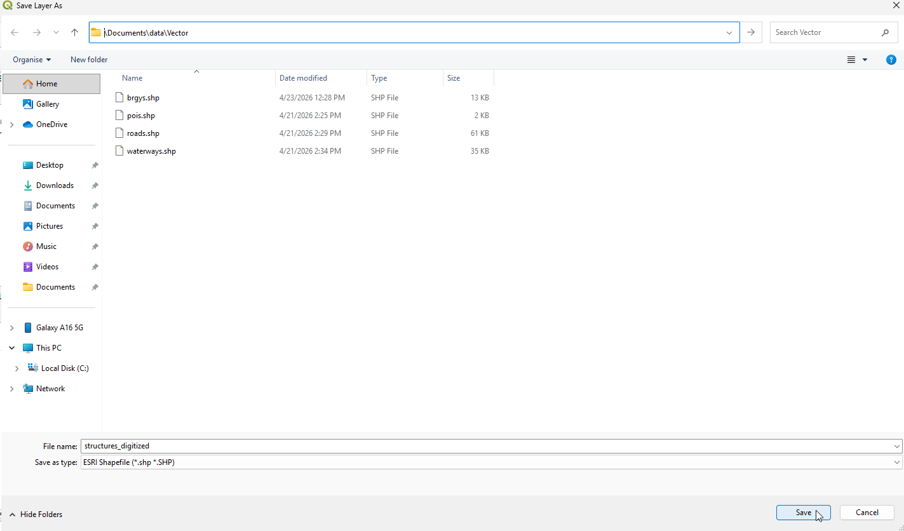

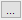

In the |mActionNewVectorLayer| :guilabel:`New Shapefile Layer` window, Click :guilabel:`OK`.  You now have a blank **structures_digitized** layer.

You can create different point, and polygon layers by selecting :guilabel:`Point` or :guilabel:`Polygon` at the :guilabel:`New Shapefile Layer` window.

:index:`Setting options for digitizing`
---------------------------------------

Before we can begin digitizing, we must set the snapping tolerance to a value that
allows us an optimal editing of the vector layer geometries.

.. tip::
   Snapping tolerance is the distance QGIS uses to search for the closest vertex
   and/or segment you are trying to connect when you set a new vertex or move an
   existing vertex. If you aren’t within the snap tolerance, QGIS will leave the
   vertex where you release the mouse button, instead of snapping it to an existing
   vertex and/or segment.

1. To set the snapping tolerance, select :guilabel:`Settings` --> |Options| :guilabel:`Options`. Under :guilabel:`Map Tools`, go to :guilabel:`Digitizing` and select :guilabel:`Snapping options`. Within the :guilabel:`Snapping options` window,
activate the :guilabel:`Enable snapping by default` and :guilabel:`Show snapping tooltips` by ticking the box.

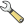

2. In the Snapping Option window,
select the following settings:

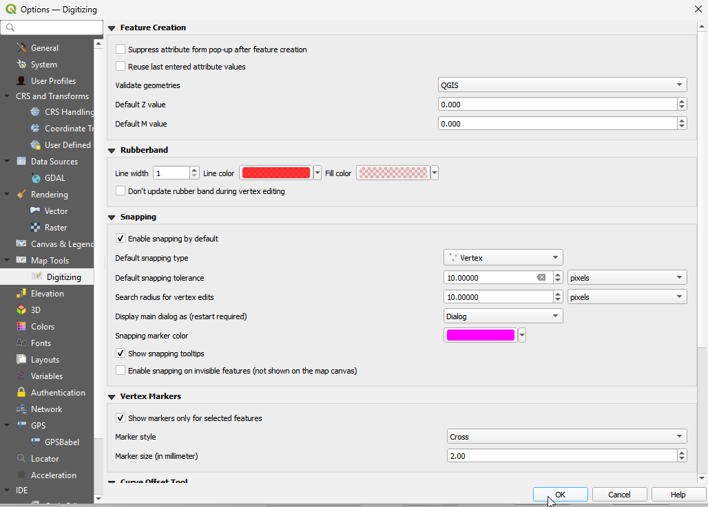

When you start editing the **structures_digitized** layer, new vertices will snap if it is within
10 pixels of another vertex.

3. Save your
project.

:index:`Digitizing vectors`
---------------------------

We will now start digitizing **structures_digitized**.

.. note::
   This process is called heads-up or :index:`on-screen digitizing`. This is an
   interactive process, in which a map is created using a previously digitized or
   scanned information. It is called "heads-up" digitizing because the attention
   of the user is focused on the screen.

1. Hide all layers except the ``structures_digitized`` and ``Valderrama_town-proper`` layer. Click the checkmark preceding the name of the layer in the :guilabel:`Map Legend`
view to hide/show layers.

2. Zoom-in to an area, where the Valderrama Municipal Hall is located.

3. Select the ``structures_digitized`` layer, right-click and select |mActionToggleEditing|
:guilabel:`Toggle Editing`.  Once the layer is in edit mode, additional tool
buttons on the editing toolbar previously greyed-out will become available.

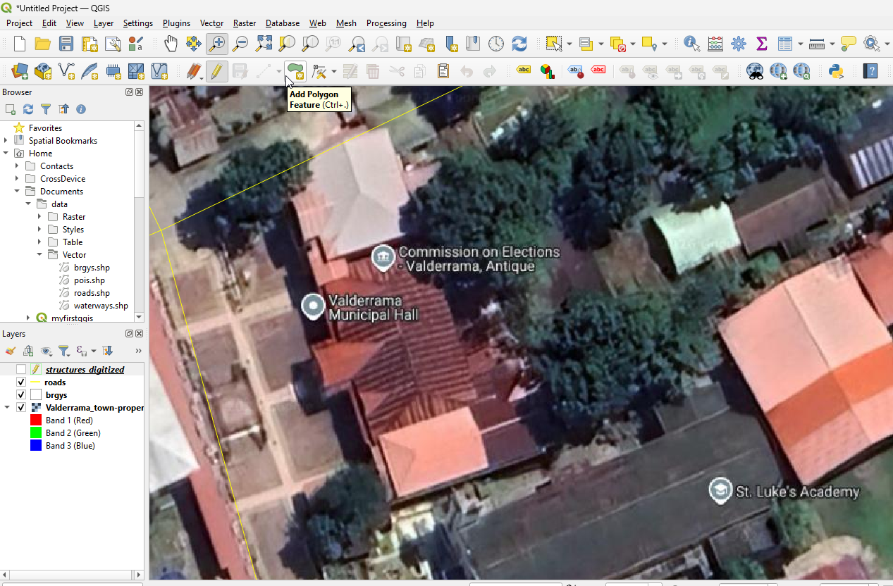

For each feature, you first digitize the geometry,
then encode the attributes.

4. To digitize the geometry, click the |mActionCapturePolygon| :guilabel:`Add Polygon Feature`,
left-click on the map area to create the first point/vertex of your new feature.

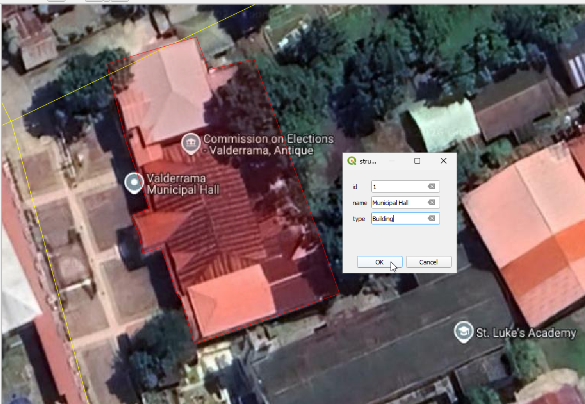

For points and lines, keep on left-clicking for each additional vertex you wish
to capture. When you have finished adding vertices, right-click anywhere on the
:guilabel:`Map view` to confirm you have finished entering the geometry of that
feature.

The attribute window will appear, allowing you to enter the information for the
new feature. Add the type of structure in the ``type`` field and the name of the
feature in the ``name`` field.

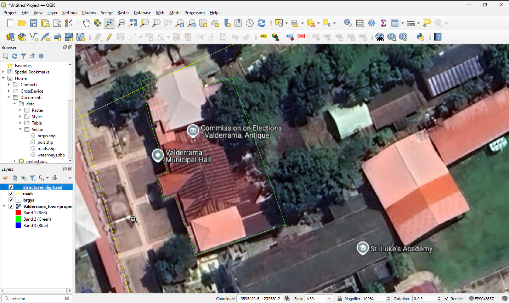

To save your editing session, |mActionToggleEditing| :guilabel:`Toggle Editing`
and click |mActionFileSave| :guilabel:`Save`.

.. tip::
   In some cases, you will reach the edge of the :guilabel:`Map View` but you
   would like to continue adding new vertices.  When this happens, use the arrow
   keys or press the spacebar while using your mouse to pan across the
   :guilabel:`Map View`.

**The Node Tool**

The |tool| :guilabel:`Node Tool` provides manipulation capabilities of
feature vertices similar to CAD programs. It is possible to simply select multiple
vertices at once and to move, add or delete them all together. It supports the topological editing
feature. This tool is, unlike other tools in QGIS, persistent, so when some
operation is done, selection stays active for this feature and tool.

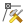

**Basic operations**

Start by activating the |tool| `Node Tool` and selecting some features by clicking on it.
Red circles appear at each vertex of this feature. Functionalities are:

* **Selecting vertex**: Selecting is easy: just click on vertex and it will become enlarged. Vertices
  can be selected at once when clicking somewhere outside the feature and opening a
  rectangle where all vertices inside will be selected. When selecting more vertices, the
  :guilabel:`Shift` key can be used to select more vertices. On the contrary, `Ctrl` key
  can  used to invert selection of vertices.

* **Adding vertex**: Just double click near some edge and a new vertex will appear
  on the edge near the cursor. Click for the third time to move it.

* **Deleting vertex**: After selecting vertices for deletion, click the
  :guilabel:`Delete` on your keyboard.

For more information on the basic operations visit this `site <https://gis.stackexchange.com/questions/278217/how-does-the-qgis3-vertex-editor-work>`_.

The rest of the basic editing tools are explained below:

* |mActionToggleEditing| :guilabel:`Toggle editing` - Enable editing of the
  selected vector layer.

* |mActionSaveAllEdits| :guilabel:`Save edits` - save your editing session in the
  currently selected layer.  This is different from Saving your project.

* |mActionCapturePoint| :guilabel:`Capture Point` - add point features.

* |mActionCaptureLine| :guilabel:`Capture Line` - add line features.

* |mActionCapturePolygon| :guilabel:`Capture Polygon` - add polygon features.

* |mActionMoveFeature| :guilabel:`Move Feature` - move location of a selected
  feature.

* |tool| :guilabel:`Vertex Tool` - activate Node tool functions.

* |mActionDeleteSelected| :guilabel:`Delete Selected` - delete selected one or
  more features.

* |mActionEditCut| :guilabel:`Cut Features` - delete a selected feature(s) from
  the existing layer and place it on a "spatial clipboard".

* |mActionEditCopy| :guilabel:`Copy Features` - place selected feature(s) into
  the "spatial clipboard".

* |mActionEditPaste| :guilabel:`Paste Features` - paste feature(s) from the
  "spatial clipboard" to the currently selected and editable layer.

Full description of the editing tools and other advanced features available in the
`QGIS User's Manual <https://docs.qgis.org/testing/pdf/en/QGIS-testing-UserGuide-en.pdf>`_.

5. Finish editing the
structures_digitized layer.

6. Save your
project.

.. tip::
   Remember to toggle |mActionToggleEditing| :guilabel:`Toggle Editing` off
   regularly. This allows you to save your recent changes, and also confirms that
   your data source can accept all your changes.

Additional Youtube Video
,,,,,,,,,,,,,,,,,,,,,,,,,,,

For the offline version of this video click this `link <videos/Creating_Vector_Layers.mp4>`_.

.. raw:: html

    

        <iframe src="https://www.youtube.com/embed/QKQOKw2qzIY" frameborder="0" allowfullscreen style="position: absolute; top: 0; left: 0; width: 100%; height: 100%;"></iframe>
    

.. raw:: latex

   \pagebreak[4]
